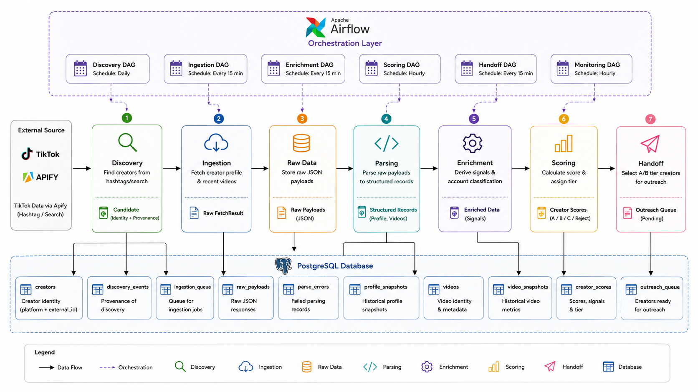

# Creator Discovery Pipeline

A pipeline that discovers, stores, and qualifies TikTok creators into an A/B/C/Reject outreach queue. Built for the NORITUAL LAB Growth Engineering Intern take-home assignment.

## Architecture



Six independent Airflow DAGs, each polling its own queue table rather than triggering the next directly. A slow or failing stage never blocks the others, and every queue table doubles as a monitoring surface (`SELECT count(*) ... WHERE status = 'pending'` is a real answer to "is this backing up").

## Discovery to ingestion: what actually advances, and why

There are **two independent gates**, not one, and they apply differently to new discoveries versus scheduled refreshes.

**For a brand-new candidate** (`pipeline/discovery/tiktok_hashtag.py`):

1. **Deduplication within one discovery run.** A hashtag search returns *videos*, not creators. The same creator often appears under several videos or several hashtags. Only the first occurrence of each `authorMeta.id` becomes a candidate; the rest are silently skipped (`seen_authors` set).
2. **Follower prequalification.** The hashtag search response already carries each author's follower count (`authorMeta.fans`) as a free byproduct, so no extra API call is needed to know it. If that count is below `MIN_FOLLOWERS_FOR_OUTREACH` (5,000, the same constant `pipeline/scoring/tiering.py` uses to `Reject` on follower count), the candidate is discarded **before** it ever reaches `ingestion_queue`. A candidate with unknown follower data (field missing from the response) is treated as fail-safe exclude, not fail-safe include.

   This is a deliberate design decision, not an oversight. It was added *after* a real Apify quota exhaustion incident during development (see `pipeline/observability/errors.py`): every ingestion fetch is a billed Apify call, and there is no reason to spend one confirming what discovery already knows for free. Reusing tiering's own constant, rather than a separate config value, means the two layers cannot silently drift apart.

3. **Idempotent enqueue.** Even a candidate that clears both gates only gets queued if it is not already sitting in `ingestion_queue` with `status='pending'` (`ON CONFLICT DO NOTHING` on `(platform, external_id, status)`). This is what stops overlapping discovery runs from queuing the same creator twice.

**For an existing creator** (`repository.creators_due_for_refresh`), the gate is different: **tier-based staleness**. A creator is only re-queued if their most recent `profile_snapshots` row is older than their current tier's refresh interval: A, 7 days; B, 14; C, 30; Reject, 90; needs_review, 3. A newly-scored A-tier creator will not be touched again for a week; a `needs_review` creator, usually meaning something is unclear about them, gets checked again soon.

**Summary:** a candidate advances from discovery to ingestion if it is a genuinely new, sufficiently large creator not already queued, or an existing creator whose tier says it is time to refresh. Everything else is either a duplicate, too small to ever qualify, or simply not due yet.

## Data model

See `sql/schema.sql` for full DDL with inline rationale. Core design decisions:

- **Snapshots, never overwrites.** `profile_snapshots` and `video_snapshots` are append-only. A follower count today does not replace yesterday's; it is a data point in a trend, which is what growth-rate and bought-follower detection depend on.
- **Identity key is `(platform, external_id)`, never `@handle`.** Handles change; platform IDs do not. Every upsert in `pipeline/db/repository.py` keys on this.
- **Raw-landing-first.** Nothing is parsed before it is in `raw_payloads`. A parser bug or an Apify payload-shape change becomes a `parse_errors` row and a retry, never silent data loss.

## Monitoring

Mapped directly against the assignment brief's own checklist ("row counts, freshness checks, a flag when a table stops growing, alerts"):

| Brief's ask | Implementation |
|---|---|
| Row counts | `count_ingestion_queue_by_status`, `count_raw_payloads_by_parse_status` |
| Freshness checks | `check_discovery_freshness`, `check_ingestion_freshness`, `check_tier_freshness` (per-tier SLA) |
| Flag when a table stops growing | Both `discovery_events` and `raw_payloads` have a dedicated zero-growth check |
| Alerts | Failed check triggers an Airflow task failure, which routes to Airflow's own email/Slack-on-failure config (not built here, named as the next real step rather than hidden) |

Plus one signal earned from an actual incident, not anticipated in the brief: **`check_quota_exhaustion`**. During development, 54 ingestion failures all traced back to Apify's free tier running out (`402 Payment Required`). A generic failure-rate check treats that identically to "the source is broken." This check specifically greps failure messages for `402`, `429`, and billing language, because those two situations need completely different responses: more budget versus paging someone.

Every check lives in `pipeline/monitoring/checks.py` as a pure function returning `CheckResult(passed, message)`, independently unit-testable with no DAG or database required to verify the logic (`tests/monitoring/`).

## Error handling

Failures are logged and stored from one shared source, not maintained separately in two places:

- `pipeline/observability/errors.py`'s `summarize_exception()` turns any exception into one short, human-readable line, recognizing the specific HTTP status codes actually hit while building this (`404` from an Apify actor-ID formatting bug, `402` from quota exhaustion) and labeling them plainly instead of leaving a bare status code to decode.
- That same summary is both logged (`pipeline/observability/logging_utils.py`, visible immediately in Airflow's task logs) and stored in `ingestion_queue.error` (queryable in aggregate, which is what `check_quota_exhaustion` depends on). One function, two outputs, so the printed version and the stored version can never drift apart.

## Running locally

```bash
cp .env.example .env   # fill in a valid, unrotated APIFY_API_TOKEN
docker compose build   # builds against Airflow's own constraints file;
                        # see the Dockerfile's comment for why this matters
docker compose up -d postgres
# wait for `docker compose ps` to show postgres as healthy
docker compose up airflow-init      # run in the foreground, wait for it to exit 0
docker compose up -d airflow-webserver airflow-scheduler
```

Airflow UI: http://localhost:8080 (admin/admin). Trigger DAGs manually, in this order, waiting for each to finish before the next. This makes it possible to watch one creator flow all the way through instead of racing five schedules at once:

```
dag_discovery -> dag_ingestion -> dag_enrichment -> dag_scoring -> dag_handoff
```

### Full clean reset

Needed after any schema change, or any time a guaranteed clean run is useful:

```bash
docker compose down -v      # drops Postgres's volume and Airflow's own metadata DB
docker compose build        # only needed if the Dockerfile or requirements changed
docker compose up -d postgres
# wait for healthy
docker compose up airflow-init
docker compose up -d airflow-webserver airflow-scheduler
```

### Inspecting the database directly

```bash
docker compose exec postgres psql -U pipeline -d creator_pipeline
```

Useful checks after a run:

```sql
SELECT source, query, count(*) FROM discovery_events GROUP BY source, query;
SELECT status, count(*) FROM ingestion_queue GROUP BY status;
SELECT error, count(*) FROM ingestion_queue WHERE status='failed' GROUP BY error;
SELECT parse_status, count(*) FROM raw_payloads GROUP BY parse_status;
SELECT tier, count(*) FROM creator_scores GROUP BY tier;
SELECT * FROM outreach_queue;
```

### Tests

```bash
python -m venv venv && source venv/bin/activate
pip install -r requirements.txt
pytest tests/ -v
```

Runs independently of Docker: pure logic (parsing, signals, tiering, enrichment against a fake in-memory repository), no live database required.

## Repository layout

```
creator-discovery-pipeline/
│
├── pipeline/
│   ├── config/
│   │   └── settings.py
│   │
│   ├── db/
│   │   ├── models.py
│   │   ├── repository.py
│   │   └── session.py
│   │
│   ├── discovery/
│   │   ├── base.py
│   │   └── tiktok_hashtag.py
│   │
│   ├── ingestion/
│   │   └── fetcher.py
│   │
│   ├── parsing/
│   │   ├── base.py
│   │   ├── tiktok_hashtag_parser.py
│   │   └── tiktok_profile_parser.py
│   │
│   ├── enrichment/
│   │   ├── identity.py
│   │   └── features.py
│   │
│   ├── scoring/
│   │   ├── signals.py
│   │   └── tiering.py
│   │
│   ├── handoff/
│   │   └── outreach.py
│   │
│   ├── monitoring/
│   │   └── checks.py
│   │
│   ├── observability/
│   │   ├── errors.py
│   │   └── logging_utils.py
│   │
│   └── ...
│
├── orchestration/
│   └── dags/
│       ├── dag_discovery.py
│       ├── dag_ingestion.py
│       ├── dag_enrichment.py
│       ├── dag_scoring.py
│       ├── dag_handoff.py
│       └── dag_monitoring.py
│
├── tests/
│   ├── discovery/
│   ├── ingestion/
│   ├── parsing/
│   ├── enrichment/
│   ├── scoring/
│   └── monitoring/
│
├── sql/
│   └── schema.sql
│
├── data/
│   ├── raw/
│   └── sample/
│
├── .env.example
├── Dockerfile
├── docker-compose.yml
├── requirements.txt
└── README.md
```

## Known limitations (named honestly, not hidden)

- **Hardcoded discovery niche.** `DISCOVERY_QUERIES` in `dag_discovery.py` is a fixed list (`skincare`, `skincareroutine`, `skincaretips`). The assignment brief does not specify a niche; this was a scoping choice for development. Production would make this data-driven (a campaigns table), not a code change.
- **N+1 query patterns** in `creators_due_for_refresh` and `recent_video_engagement`: one query per creator rather than a single join. Deliberate for readability at this scale (10K creators/month); named explicitly as the first thing to optimize toward 1M/month.
- **`classify_account_type`'s keyword matching has no concept of negation.** A bio reading "no shop here" false-positives as a reseller. Documented and tested as a known limitation rather than silently wrong (`tests/scoring/test_signals.py`).
- **All active creators get rescored every hourly cycle**, not just ones that changed. Simple and correct at this scale; a named optimization opportunity at higher volume.
- **Monitoring alerts on task failure only.** No Slack, email, or PagerDuty integration built; Airflow's own failure notification config is the extension point.
